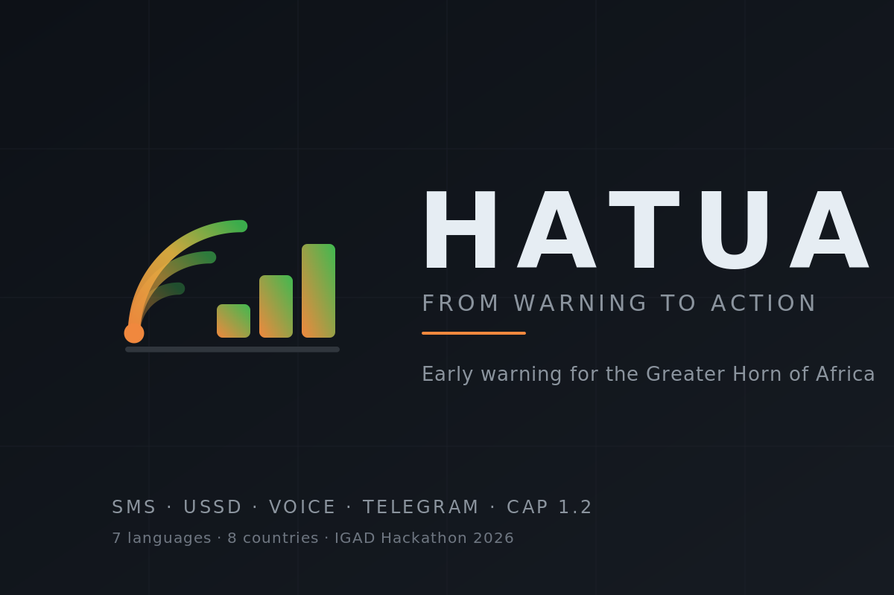
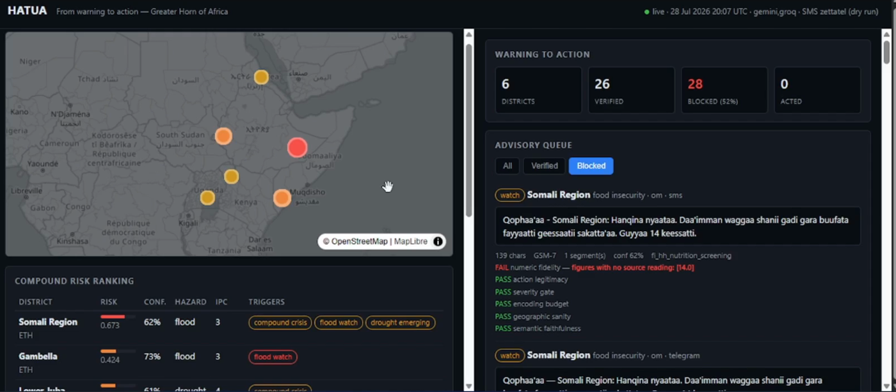
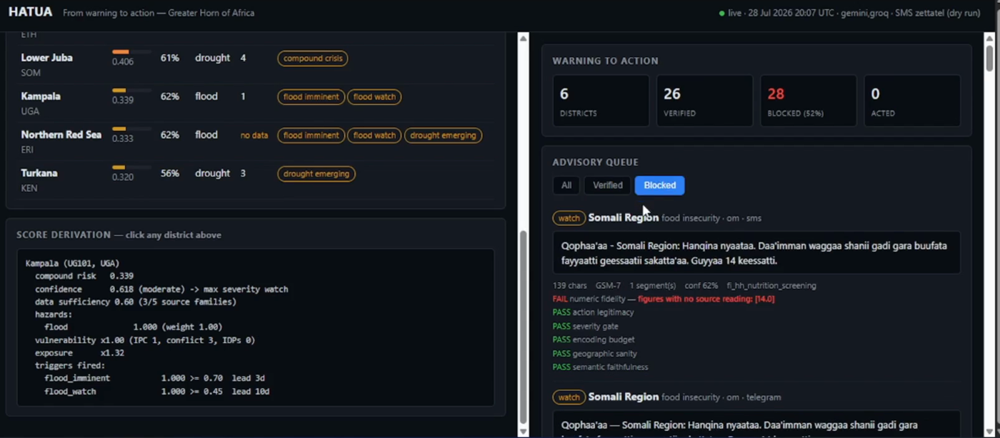
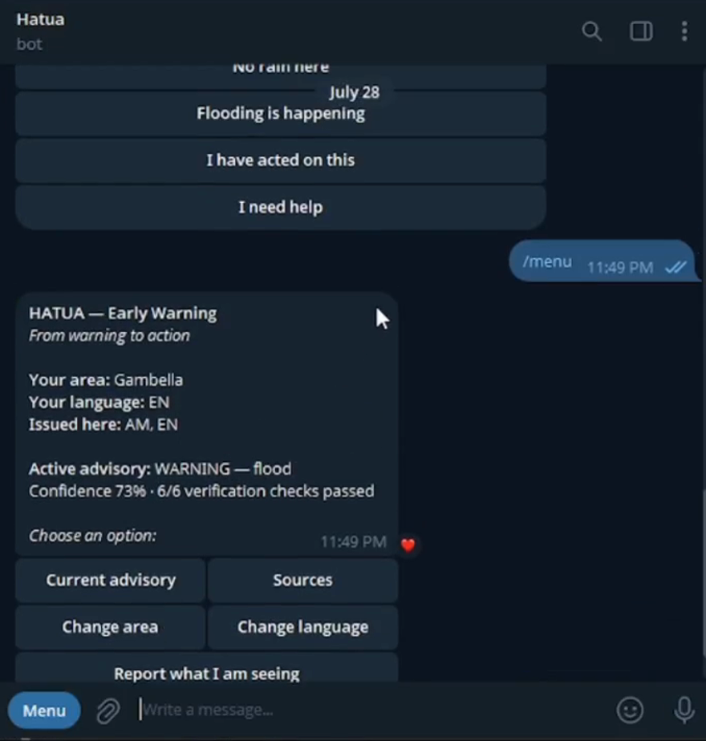

<p align="center">
  
</p>

<p align="center">
  <strong>From warning to action — the last mile of early warning for the Greater Horn of Africa.</strong>
</p>

<p align="center">
  <a href="https://hatua.onrender.com"><strong>Live dashboard</strong></a> ·
  <a href="https://youtu.be/EBQ8QTpsFk0"><strong>Demo video (4 min)</strong></a> ·
  <a href="https://t.me/Hatua_bot"><strong>Telegram bot</strong></a>
</p>

---

*Hatua* is Swahili for **action**, or **step**. ICPAC's dissemination platform is
called HUSIKA — "be concerned". HATUA is the step after.

Built for the **IGAD Hackathon 2026: Smarter Early Warning, Stronger Communities**.

> The live dashboard is on Render's free tier and sleeps when idle. The first
> request can take around 50 seconds to wake it.

---

## What it looks like

**The officials' dashboard.** Six districts across four countries, ranked by
compound risk. Every score is clickable and derives itself in plain arithmetic.



**The Verifier blocking an advisory.** 28 of 54 advisories were blocked on this
run. Five of the six checks are deterministic — a check that depends on a model
cannot police a model. Here the model used a figure that appears in no source,
and the advisory was never sent.



**The Telegram bot.** Note *Issued here: AM, EN* — HATUA only offers languages
it actually publishes for that district, rather than advertising a language and
then failing to deliver it.

<p align="center">
  
</p>

**USSD**, for a feature phone with no credit and no data — 68% of Ethiopian
women own a phone, 9% use mobile internet. Stateless, sub-3-second, cache reads
only:

```
*384*1#
> CON HATUA Early Warning
  Chagua eneo / Area:
  1. Somali Region  2. Gambella  3. Lower Juba
  4. Kampala  5. Northern Red Sea  6. Turkana

1
> END Somali Region: Take children under 5 to health facility
  for nutrition check within 14 days
```

District first, then only the languages actually issued for it — asking for a
language HATUA cannot deliver in wastes the one session the user has.

---

## The problem

The Greater Horn of Africa does not have a forecasting problem.

ICPAC, the national meteorological agencies, FEWS NET and GDACS already produce
good science. As this was written there was an **active GDACS Orange drought
alert over Ethiopia, Kenya and Somalia** (event `1027450`, running since April
2026) and ICPAC was publishing weekly rainfall anomaly and heat-stress forecasts
valid days ahead.

The information exists. It does not reach the people who need to act on it, in
a form they can act on. Three specific failures:

**1. Translation.** A forecast says *"SPI-3 of −1.4, 60% probability of
below-normal rainfall."* A pastoralist in Marsabit needs *"the next rains will
fail — sell the weak animals now, before everyone else does and the price
collapses."* Nobody is doing that conversion at scale.

**2. Channel.** GSMA's 2026 Mobile Gender Gap Report: **68% of Ethiopian women
own a mobile phone; 9% use mobile internet daily.** That 59-point gap is the
population most exposed to climate shocks and least reachable by any dashboard
or app. They are reachable by SMS, USSD and voice — and by essentially nothing
else.

**3. Compound risk.** Existing systems are single-hazard. Drought is monitored
separately from conflict, separately from displacement, separately from food
insecurity. In this region those are the *same crisis*. A drought in a district
at IPC Phase 4 with active conflict and 64,000 displaced people is not the same
event as the same drought in a stable district, and must not produce the same
warning.

---

## What HATUA does

Takes live multi-hazard data for all eight IGAD member states, reasons about
compound risk at district level, and emits **verified, actionable, localised
advisories** down every channel that reaches a feature phone — with a guardrail
that refuses to send anything not traceable to source data.

```
  OFFICIAL SOURCES              REASONING CORE                 LAST MILE
  ────────────────              ──────────────                 ─────────
  CONSUMED EVERY RUN                                     ┌─ SMS   (GSM-7/UCS-2 aware)
  Open-Meteo forecast  ┐    ┌────────────────────┐       ├─ USSD  (stateless, 0.05ms)
  Open-Meteo / GloFAS  │    │  Signal Fusion     │       ├─ Voice (pre-rendered TTS)
  GDACS multi-hazard   ├───►│  (deterministic,   │──┐    ├─ Telegram (bot + channels)
  ICPAC dataset currency│   │   no model)        │  │    ├─ Dashboard (officials)
  National CAP × 7     ┘    └────────────────────┘  │    └─ CAP 1.2 feed (interop)
                                                    │
                            ┌────────────────────┐  │               ▲
                            │  Impact Analyst    │◄─┘               │
                            │  Action Planner    │                  │
                            │  Localizer         │                  │
                            │  ══ VERIFIER ══    │──────────────────┘
                            └────────────────────┘
                                      ▲          nothing passes unverified
                                      │
                          community ground-truth replies
```

---

## The three ideas that matter

### 1. The numbers are deterministic. Only the words are generated.

`hatua/fusion/engine.py` contains **no model**. It is arithmetic, and that is
deliberate: the numeric basis of a life-safety warning must be reproducible and
inspectable. If a district is told to move livestock, an ICPAC analyst must be
able to open one file, read the weights, and disagree with a specific number.
You cannot do that with an embedding.

```
CRS = hazard_composite
      × exposure_multiplier       (who and what is there,        max 1.5)
      × vulnerability_multiplier  (can they absorb it — IPC,
                                   conflict, displacement,       max 2.6)
      ÷ (1.5 × 2.6)               (normalise against the theoretical maximum)
```

Confidence is deliberately **not** a term in this score. It is computed
separately and used to gate *whether a trigger fires at all* and *how severe an
advisory is permitted to be* — because a hazard is no less dangerous for our
being unsure about it. Folding uncertainty into the risk number would quietly
downgrade a real threat we happen to have thin evidence for, when the correct
response is to warn more cautiously, not to rank the district lower.

The reasoning core above it never computes risk. It *explains* risk computed
here, and the Verifier checks its explanation back against these numbers.

Live output, ranked:

| District | Risk | Conf. | Dominant | Triggers |
|---|---|---|---|---|
| Somali Region, ET | 0.655 | 0.55 | flood | compound_crisis, flood_watch, drought_emerging |
| **Lower Juba, SO** | **0.571** | **0.82** | drought | **compound_crisis**, drought_emerging |
| Turkana, KE | 0.371 | 0.67 | drought | drought_emerging, drought_severe |
| Kampala, UG | 0.364 | 0.55 | flood | flood_watch |
| Tana River, KE | 0.229 | 0.74 | drought | drought_emerging |

> **On the vulnerability figures.** IPC phase, conflict-event counts and IDP
> numbers in the demonstration district set (`hatua/api/districts.py`) are
> **pinned representative values** in the range HDX HAPI returns for these
> areas, not fetched live. They are pinned so the demo is reproducible and so a
> reviewer can see exactly what drove each score. The hazard signals — rainfall,
> river discharge, GDACS alerts, ICPAC currency, national CAP alerts — *are*
> live on every run. We would rather say this plainly than let a reader assume
> the conflict counts came off a wire.

Lower Juba's drought signal is only *moderate* (0.65). It ranks second overall
because IPC Phase 4, 87 conflict events and 64,000 IDPs multiply it. A
single-hazard system would have ranked it below Turkana. **Kampala has a real
flood signal and correctly sinks to the bottom half** — it has no underlying
vulnerability. That contrast is the entire argument.

### 2. The Verifier blocks. It does not warn.

HATUA sends messages asking people to make irreversible decisions — sell the
breeding stock, move the family, harvest early. A hallucinated rainfall figure
is not a quality defect to be tuned away with a better prompt. It is a harm, and
it needs a mechanism.

Six checks. **Five are deterministic and run first**, because a check that
depends on a model cannot be trusted to police a model. The LLM adjudicates only
the sixth, and its vote can *block* but never *rescue*. If verification itself
errors, the advisory is blocked — it fails closed.

| Check | What it enforces |
|---|---|
| `numeric_fidelity` | Every figure above a small structural threshold traces to a `SignalReading`, within 0.5%. Folds **Arabic-Indic** (٦٤٠٠٠) and **Ethiopic** (፻፳፭ → 125) numerals first — Ethiopic is Unicode category `No`, so `\d` and `unicodedata.decimal` both miss it, and an Amharic advisory could otherwise carry unverified figures straight through. |
| `action_legitimacy` | Every `action_id` exists in the approved library |
| `severity_gate` | Severity within the ceiling that confidence permits |
| `encoding_budget` | Fits its channel and language segment cap |
| `geographic_sanity` | The message body itself names the district it applies to |
| `semantic_faithfulness` | *(LLM)* No unsupported causal, temporal or instructional claims |

**It earns its place.** On the first live run it caught the model appending
*"Avoid conflict areas and protect your livestock"* to an English advisory —
plausible-sounding humanitarian advice that appears in no approved action,
authorised by nobody. Blocked.

It also produced a **false positive** worth recording honestly: it initially
blocked a *correct* message for citing a 14-day deadline, because we had not
shown the verifier the approved action deadlines. Over-blocking is the right
failure direction for a life-safety system, but it is a real tuning cost and we
are not going to pretend otherwise.

The dashboard **shows blocked advisories rather than hiding them**. A
verification layer nobody can inspect is just a claim.

### 3. The model selects actions. It never writes them.

Ask a language model what a pastoralist should do about a drought and it will
produce something fluent, plausible, and occasionally ruinous. *"Sell your
livestock now"* is correct in month one of a failing season and catastrophic in
month four, when everyone is selling and prices have collapsed — it converts a
recoverable shock into permanent destitution.

So `hatua/agents/actions.py` is a fixed library drawn from published IGAD, FAO,
WFP and IFRC anticipatory action protocols. The model selects `action_id`s and
adds local context. The Verifier rejects anything else.

**The safety property that matters most is `no_regret`.** Below HIGH confidence,
only no-regret actions are *shown* to the planner at all — actions that remain
beneficial even if the forecast is wrong. A 45%-confidence drought signal cannot
tell a family to sell its breeding stock, because that action is not in the list
the model can see. The constraint is applied before generation, not policed
after it.

---

## Engineering details worth reading

### SMS encoding is not `len(text)`

Most SMS integrations count characters. That is wrong three ways, and each costs
money or truncates a life-safety message.

| Language | Script | Encoding | Chars/segment |
|---|---|---|---|
| Swahili, Somali, Afaan Oromo | Latin | GSM-7 | **160** |
| Amharic, Tigrinya | Ge'ez | UCS-2 (forced) | **70** |
| Arabic | Arabic | UCS-2 (forced) | **70** |

**There is no escape from this for Ge'ez.** 3GPP TS 23.038 defines national
language shift tables for Turkish, Spanish, Portuguese and several Indic
scripts. There is none for Ethiopic and there never will be. So a 300-character
flood advisory is **2 segments in Swahili and 5 in Amharic** — 2.5× the cost for
identical content. At 100,000 subscribers that is 200,000 billed segments versus
500,000.

Hence the rule the Localizer enforces: **write the Amharic template first and
back-translate.** Design for Swahili first and you build something unaffordable
in Ethiopia.

Then there is the bug nobody catches. The typographic apostrophe `’` (U+2019) —
which every word processor, CMS and language model produces by default — **is
not in GSM-7**. One of them silently converts a 160-character Somali advisory
into a 70-character UCS-2 message and more than doubles the bill. Twilio ships
"Smart Encoding" to substitute these. Africa's Talking does not. We do it
ourselves:

```
Somali advisory, 109 chars, with U+2019   →  UCS-2, 2 segments
Same text, normalised                     →  GSM-7, 1 segment
```

Extension characters `^ { } [ ] ~ | \ €` each cost **two** septets, so an
apparently 160-character message containing three brackets is 163 septets and
becomes two segments. We count septets, not characters.

### USSD dictated the architecture

Airtel's connect-to-application timeout is 10 seconds; real handsets on real
networks eat most of that. So **no model call, no forecast fetch and no
translation may happen on the USSD path.** Every advisory served there is
pre-computed by the scheduler and read from cache.

That single constraint is why the whole pipeline generates advisories on a
schedule rather than on demand. Measured: **0.05 ms per screen against a
3,000 ms budget.**

Session state is derived purely from `text.split('*')` — the gateway holds none,
so neither do we. No Redis, no TTL bugs, and a restart mid-session is invisible
to the caller.

USSD is **Latin script only**, deliberately. Ethiopic and Arabic in USSD are
rendered by the handset's dialer firmware, which on cheap feature phones
frequently lacks the font; Arabic USSD arriving blank is a documented failure.
Ge'ez and Arabic speakers are offered Latin-script options in the menu and
receive their own script by SMS, where the messaging app renders it properly.

### Provider independence is an operational requirement

A humanitarian early warning service that hard-depends on one commercial model
vendor is not a system anyone should deploy. `LLM_PROVIDER` accepts
`gemini | groq | cerebras | openrouter | anthropic`.

It is not theoretical. Free-tier quota is metered **per model** — during
development `gemini-flash-latest`, `gemini-2.0-flash` and `gemini-2.0-flash-lite`
were all exhausted while `gemini-flash-lite-latest` answered normally on the same
key in the same second. There is an automatic fallback chain. A smaller model
answering now beats the right model answering after the flood.

### SMS economics decide whether this is deployable

The same message to the same Safaricom handset:

| Provider | KES/segment | 100,000 recipients |
|---|---|---|
| HostPinnacle | 0.20 | **KES 20,000** (~US$155) |
| Mobitech | 0.30 | KES 30,000 |
| Zettatel | 0.40 | KES 40,000 |
| Africa's Talking | 0.80 | KES 80,000 |
| **Twilio** | **40.40** | **KES 4,040,000** |

Global CPaaS is roughly **200× the cost** of Kenyan aggregation for an identical
message. That is the entire reason a service like this is affordable at national
scale, and why the provider is a config value rather than something welded into
the delivery path.

One non-obvious finding: Zettatel returns `startHour: -1, endHour: -1` — **no
time-of-day restriction**. Several competitors' free routes only deliver
08:00–19:00, which would make a 3 a.m. flood warning undeliverable.

---

## Data sources

Every source below was **verified live against its real endpoint**. Sources are
split into those the pipeline actually consumes on each run and those we
verified as reachable and built connectors toward but do not yet fuse — because
"we checked this API works" and "this API drives our output" are different
claims, and only one of them is a feature.

**Consumed by the running pipeline** — these are fetched on every refresh:

| Source | What it provides | Key? |
|---|---|---|
| [ICPAC East Africa Hazards Watch](https://eahazardswatch.icpac.net/) | 36 datasets: rainfall forecast & anomaly, exceptional rainfall, heat stress, subseasonal probabilistic rainfall, combined drought indicator, forage forecast, displacement | none |
| [ICPAC Drought Watch](https://droughtwatch.icpac.net/) | SPI, CDI, fAPAR, soil moisture anomaly, drought exposure & resilience | none |
| [ICPAC Triggers & Thresholds](https://eatriggersthresholds.icpac.net/) | SPI/SPEI drought trigger layers, available-date index | none |
| National met agency **CAP feeds** | Official government alerts — Kenya, Ethiopia, Somalia, Sudan, South Sudan, Djibouti | none |
| [Open-Meteo](https://open-meteo.com/) | 16-day forecast, all 8 countries in one request | none |
| [Open-Meteo Flood](https://open-meteo.com/en/docs/flood-api) | GloFAS v4 river discharge, 210-day horizon | none |
| [GDACS](https://www.gdacs.org/) | Live drought/flood/cyclone events with alert level and polygon | none |
| [HDX HAPI](https://hapi.humdata.org/) | IPC phase, ACLED conflict, IOM displacement, UNHCR refugees, population, food prices — all P-coded | self-issued |
| [FEWS NET FDW](https://fdw.fews.net/api/) | IPC phase with native GeoJSON geometry | none |
| [ClimateSERV](https://climateserv.servirglobal.net/) | CHIRPS zonal statistics at admin-2 | none |
| [WHO](https://www.who.int/emergencies/disease-outbreak-news) | Disease Outbreak News | none |
| [USGS](https://earthquake.usgs.gov/) | Earthquakes — the Afar rift is genuinely active | none |

### Gotchas that cost real debugging time

- **ICPAC WMS** requires `STYLES=` (mandatory, MapServer 8), `SRS=EPSG:3857`
  with a metre bbox (EPSG:4326 fails regex validation), and `time=YYYY-MM-DD`
  (the ISO datetime in `latest_date` throws `msApplySubstitutions()` errors).
  It is also **intermittently PostGIS-broken and returns `ServiceException`
  with HTTP 200** — a status-code check reads failure as success. There is a
  layer health probe.
- **GDACS** `eventlist=EQ;FL;DR` silently drops everything after the first type.
  One request per hazard.
- **HAPI** `start_date` needs a full ISO datetime or it silently returns
  unfiltered rows. `conflict-events` is admin2-only.
- **FEWS NET FDW** ignores unknown query params and returns full dumps —
  unfiltered Kenya `ipcphase` is 42 MB.
- **Zettatel** returns HTTP 200 on credential failure. Parse the body.

---

## Coverage gaps we render as gaps

**Eritrea** has no IPC data in HAPI, zero FEWS NET rows, no WMO-registered CAP
feed, and a 2001 census baseline. **Djibouti's** food security data ends in 2015.

These appear on the dashboard as **"no data"**, not as a score. Fabricating
coverage in a life-safety system is worse than absent coverage, because it is
trusted.

---

## Honest limitations

Stated because judges in this field have watched a lot of teams overclaim.

- **SMS is an advisory channel, not a flash-flood alarm.** At ~10 msg/s
  alphanumeric throughput, 100,000 subscribers takes ~2.8 hours. The correct
  technology for imminent mass alerting is **Cell Broadcast** — no opt-in, no
  MSISDN list, no congestion, overrides silent mode. The Communications
  Authority of Kenya is rolling out a CAP-based capability. **We emit CAP 1.2 so
  we plug into it on day one rather than needing a rewrite.**
- **Live USSD in Kenya costs KES 10,000–40,000/month** plus a KES 5,000 deposit.
  Our demo runs on the sandbox simulator. We quote the real figure rather than
  implying it is free.
- **Aggregator reach is partial.** Africa's Talking covers SMS in 3 of 8 IGAD
  states and USSD in 2. Somalia has six zone-monopoly operators and no single
  aggregator reaching the country. Eritrea is effectively unreachable
  programmatically.
- **We do not generate freely into low-resource languages, because we measured
  it failing.** Asked for an Amharic drought advisory for Somali Region,
  Ethiopia, a 70B model produced text back-translating to roughly *"there is a
  medical violation in the ground, Amhara region"* — incoherent, and naming the
  wrong region. Afaan Oromo was comparably bad. This matches the literature:
  Google Translate scores 75.8 chrF++ on Swahili and **30.2 on Amharic**;
  Tigrinya is not benchmarked at all; small general-purpose LLMs score 3–11,
  which is noise.

  So **Amharic, Tigrinya, Afaan Oromo and Arabic go through pre-translated
  templates** (`hatua/agents/templates.py`) — fixed, reviewed sentences with
  only numerals, place names and dates substituted. English, Kiswahili and
  Somali are generated and verified as normal.

  The point of the template file is that **a native speaker can read the entire
  surface area of what HATUA will ever say in Amharic in one sitting.** That is
  the only review that means anything. Where no reviewed template exists, we
  emit nothing — an honest silence beats a message a native speaker would not
  recognise as their language.

  Template advisories skip the *semantic* verification step and are marked
  `source="template"`, because asking a model that cannot read Afaan Oromo to
  adjudicate Afaan Oromo is circular — in testing it rejected correct
  templates. All five deterministic checks still apply in full.

  We never auto-transliterate a life-safety warning.
- **HATUA is not an alerting authority.** The CAP feed is marked
  `status=Exercise` and certainty never exceeds `Likely`, because we forecast
  and fuse; we do not observe.
---

## Voice: reaching people who cannot read the advisory

Adult literacy is roughly 60% in Ethiopia and 54% in Somalia, and materially
lower among women — **50% of Ethiopian women and 44% of Somali women**. A
text-only early warning system therefore cannot reach about half the adult
women in two of the countries most exposed to drought. Those are also the
people who manage household water and take children to a health facility.

Neither Twilio's nor Africa's Talking's `<Say>` verb helps: both route to
Google Cloud TTS, which has **no GA voice** for Swahili, Amharic, Somali,
Afaan Oromo or Tigrinya. So audio must be pre-rendered and served to the
telephony provider as a URL via `<Play>`.

We use **Meta's open-weights MMS-TTS**, which covers **all seven languages we
issue advisories in — including Afaan Oromo and Tigrinya, which no commercial
cloud TTS supports anywhere**: not Azure, Google, Amazon, OpenAI or ElevenLabs.

```
data/audio/  am_….wav   Amharic       ✅ rendered
             so_….wav   Somali        ✅ rendered
             om_….wav   Afaan Oromo   ✅ rendered
             en_….wav   English       ✅ rendered
```

Served live at `/audio/<filename>` — that URL is the actual IVR path, what
Africa's Talking fetches and plays down a phone line.

`scripts/render_audio.py` renders offline; the deployed service never loads a
TTS model. Two things that will bite anyone reproducing this:

- **MMS needs `uroman` for non-Latin scripts.** Without it, transformers emits
  a warning and *carries on*, producing a WAV that sounds like speech and does
  not say what the advisory says. That failure mode is worse than a crash, so
  the script refuses to render Ge'ez or Arabic script unless `uroman` imports.
- **Afaan Oromo is `orm`, not `gaz`.** `facebook/mms-tts-gaz`, `-gax`, `-hae`
  and `-orc` do not exist, despite `gaz` (West Central Oromo) being the more
  precise ISO 639-3 code. Meta published under the macrolanguage code.

Licence is CC-BY-NC-4.0 — fine here, a hard stop if commercialised. For
production the stronger answer remains a native-speaker phrase bank: for early
warning, hazard × severity × district is a *bounded* set, so it is recordable
in an afternoon and would beat any synthesis. MMS gets us real, correct-language
audio today.

---

## Relationship to ICPAC's existing work

ICPAC already runs **HUSIKA**, a RapidPro-backed dissemination platform. Its
messaging service exposes `/v1/rapidpro-raw/*` endpoints publicly and its
ingestor has a full broadcast model (`POST /v1/broadcasts`, `/broadcast/fire`).

**HATUA is not a replacement for HUSIKA and does not pretend to be.**

HUSIKA solves *broadcast* — getting a message to a subscriber list. HATUA solves
the layer above it: deciding **what the message should say, for whom, in which
language, at what severity — and proving it is true before it is sent.** HUSIKA
is the pipe; HATUA is what should go down the pipe.

The delivery layer is a pluggable adapter, so HUSIKA is a first-class output
target alongside the SMS aggregators. Trigger semantics are aligned to ICPAC's
own thresholds-and-triggers framework rather than invented in parallel, and the
CAP output makes the whole thing interoperable by default.

---

## Running it

```bash
git clone https://github.com/simonMakumi/Hatua_IGAD.git
cd Hatua_IGAD
pip install -r requirements.txt
cp .env.example .env          # add GEMINI_API_KEY and HDX_HAPI_APP_IDENTIFIER
python scripts/build_snapshot.py 5
uvicorn hatua.api.app:app --reload
```

Open http://localhost:8000

| Endpoint | Purpose |
|---|---|
| `/` | Officials' dashboard |
| `/health` | Service and provider status |
| `/api/districts` | Ranked compound risk |
| `/api/districts/{pcode}/explain` | Full derivation of a score |
| `/api/advisories` | Advisory queue, including blocked |
| `/api/feedback` | Warning-to-action funnel |
| `/api/cap.xml` | CAP 1.2 feed |
| `/ussd` | Africa's Talking callback |
| `/ussd/simulate?text=` | Browser-testable USSD |

**`DRY_RUN=true` is the default.** Nothing reaches a real handset until it is
deliberately flipped. An early warning system that can message people by
accident is a liability.

### Deploying

```bash
# Render reads render.yaml; set secrets in the dashboard, never in git
docker build -t hatua . && docker run -p 8000:8000 --env-file .env hatua
```

---

## Repository layout

```
hatua/
  models.py            Typed contracts. Every number in a dispatched advisory
                       traces back to a SignalReading through these.
  config.py            Settings, regional constants, verified endpoints
  ingest/              Connectors — icpac, openmeteo, gdacs, base
  fusion/engine.py     Deterministic compound risk and triggers. No model.
  agents/
    llm.py             Provider-agnostic client with model fallback
    actions.py         Approved anticipatory action library
    core.py            Impact Analyst, Action Planner, Localizer
    verifier.py        The blocking guardrail
  delivery/
    encoding.py        GSM-7/UCS-2 septet accounting
    sms.py             Pluggable SMS providers
    telegram.py        Bot and channel publishing
    ussd.py            Stateless menu, sub-3s
  api/
    app.py             FastAPI service
    dashboard.py       Single-file dashboard
    cap.py             CAP 1.2 output
    districts.py       Demonstration district set
  pipeline.py          ingest → fuse → trigger → reason → verify
```

---

## Licence and attribution

Built for the IGAD Hackathon 2026. All external data sources are open and
attributed above; all are used within their published terms.

ICPAC is the WMO Regional Climate Centre for the Greater Horn of Africa. This
project builds on their published data and platforms with respect, and would be
worth nothing without them.
